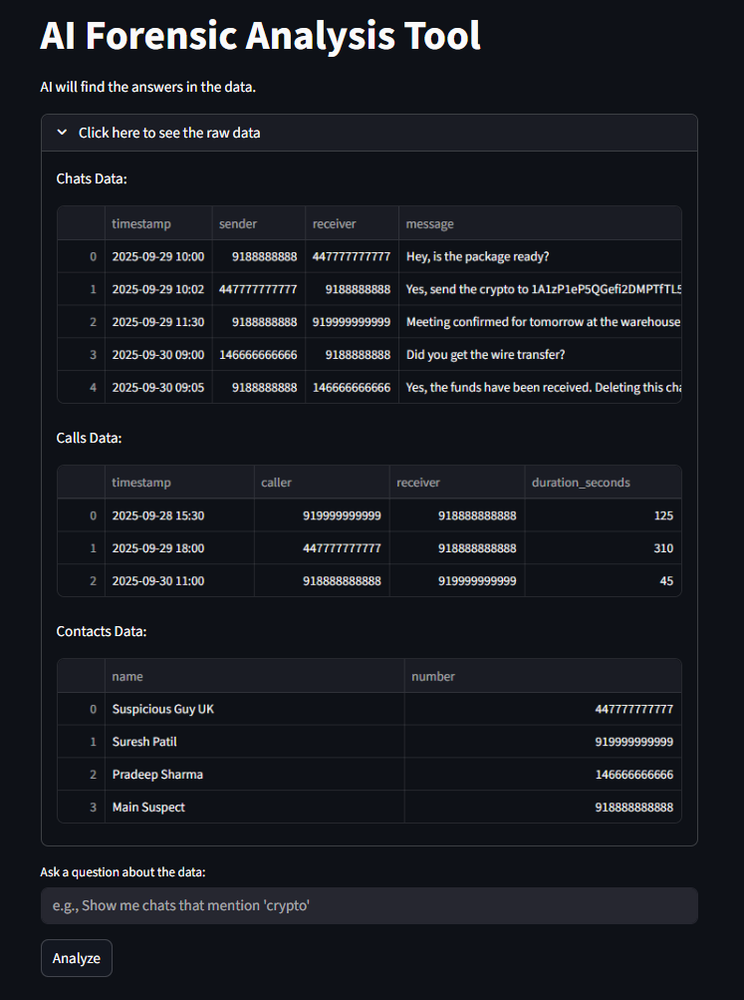

# UFDR sample-data prototype

A Streamlit experiment that asks Gemini questions about sample chat, call and
contact CSVs. It sends the **first 20 rows of each CSV** to the model and displays
a plain-English answer. It does not parse UFDR archives, execute generated
filtering code or analyze every record in a large report.



## Run locally

```sh
git clone https://github.com/Rhythm-Sanghi/AI-based-UFDR---Prototype.git
cd AI-based-UFDR---Prototype
python -m venv .venv
```

Activate `.venv` (`.venv\Scripts\Activate.ps1` on Windows, or
`source .venv/bin/activate` on macOS/Linux), then install dependencies:

```sh
python -m pip install -r requirements.txt
```

Create `.streamlit/secrets.toml` locally:

```toml
GEMINI_API_KEY = "your-google-api-key-here"
```

The secrets file is ignored by Git. The current implementation uses Gemini
only, with model `gemini-2.5-flash` configured in `app.py`.

```sh
streamlit run app.py
```

## Use

Expand **Show raw data** to inspect the bundled CSVs. Enter a question and click
**Analyze**. The **Answer** section displays the model's response, not generated
Python code or a validated query result.

## Limits

- Bundled records are sample data for a demonstration.
- Only the first 20 rows per file enter the prompt, even if the raw-data view
  shows more rows. Answers cannot establish totals or facts about omitted rows.
- Those excerpts are sent to the external Gemini service. Use sample data for
  this demonstration rather than substituting confidential reports.
- Model answers can be incorrect; check them against the source rows. This
  prototype does not provide a forensic validation or evidence-review workflow.

## Files

`app.py` contains the interface and model request. `data/` contains the three
sample CSVs. `requirements.txt` lists Streamlit, pandas and the Gemini client.
